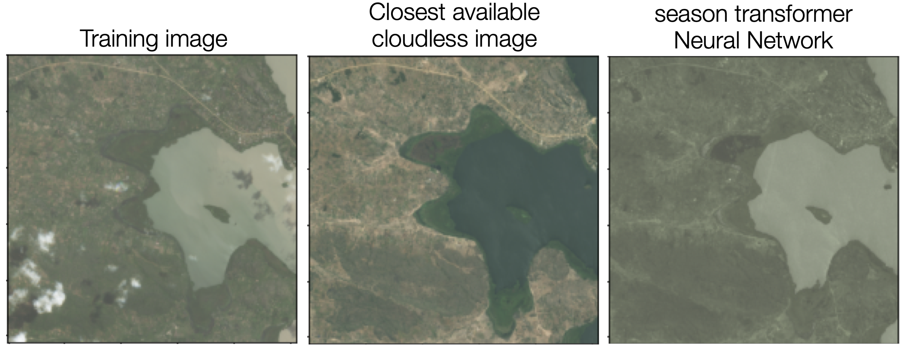

# cloud-segmentation
Authors: [Dana Simard](https://sites.astro.caltech.edu/~simard/) & [George Stein](https://georgestein.github.io/)

This repository outlines our work to predict cloud cover in satellite imagery, undertaken as part of Driven Data's *[Cloud Cover Detection Challenge](https://www.drivendata.org/competitions/83/cloud-cover/)*, where we placed in the top 3% of 850 participants (achieving an Intersection over Union (IoU) only 0.0037 behind the winning submission). This README first outlines our approach, followed by detailed code description.

|  | 
|:--:| 
| *Our cloud predictions (red) and the "true" clouds (black). We were even able to predict cloud cover far better than the (messy) labels provided! Just look at the panel on the right - the human labeler provided only very rough cloud lines, misidentified buildings as clouds, and labelled clouds where there were none. Our predictions were much more robust* |

Our data-centric approach consisted of four main components:

1. Perform data discovery through to obtain a thourough understanding of the dataset and identify useful sets of data features for model training (DANA)
2. Obtain and leverage vast amounts of additional (unlabelled) satellite imagery, achieved through a series of API calls to [Microsoft' s Planetary Computer](https://planetarycomputer.microsoft.com/)
3. Design a custom set of physically-motivated data augmentations to further expand the effective dataset size (*which required training 10,000 individual Neural Networks!*).
4. Identify optimal feature/model sets, and train an ensemble of convolutional neural network segmentation models to predict cloud cover.

|  | 
|:--:| 
| *Our custom CloudMix augmentation. Using image/label pairs from the training set (left) we extract the change in intensity due to the presence of clouds. By accumulating new images from locations around the world (right three panels) we can now add perfectly realistic cloud/label pairs to expand our training set to include never-before seen topography!*|

## Competition Details

Competitetors were given a training set of ~10,000 4-band satellite images from the Sentinal-2 mission, and a corresponding label for each pixel - no cloud (0) or cloud (1). Each band image was provided as a 512 pixel x 512 pixel GeoTiff, and each pixel had a real-world resolution of 10m:

| Band | Description | Center Wavelength |
| ---- | ----------- | ----------------- | 
| B02 | Blue visible light	| 497 nm |
| B03 | Green visible light | 560 nm |
| B04 |	Red visible light | 665 nm |
| B08 |	Near infrared light | 835 nm |

Any additional data from the Planetary Computer, whether it be additional bands for each image, or seperate locations/observation times, was allowed to be used. Competitors ranking in the contest was determined by the highest Intersection over Union (IoU) of the predicted cloud pixels vs the true cloud labels on a hidden test set.   

## Dataset Investigation and Feature Prediction

**For Dana**

Maybe Pretty analysis Plot? Expand as much as you want

|  | 
|:--:| 
| *Feature-based predictions*|

## Aquireing Additional Data

To pull additional data we leveraged the public APIs for the Planetary Computer, and utilized multiprocessing to perform calls in parallel. We developed three main functionalities:

1. Given an image from the training set, find images of the same region at different observation times, subject to data quality cuts (e.g. estimated cloud cover at the new observation time).
2. Download additional band data for a given location and time. Used to supplement the 4 bands originally given.
3. Download images from random locations on the earth, outside of areas used for training data.    

The script to perform the calls is `scripts/pull_additional_chip_data.py`, which assesses functions in `cloud_seg/pc_apis/query_bands.py`.

We used our scripts to optain all extra band information (B01 through B12) for each image from the training set.

## Developing Custom Data Augmentations

A main advantage of our approach was a custom designed augmentation we termed ***CloudMix*** - a physically motivated, satellite-imagery upgrade of the simple [CutMix](https://arxiv.org/abs/1905.04899) augmentation.

The idea is as follows:

1. For each of the 10,000 training images given, find a cloudless image of the same area on earth from a day with minimal cloud cover.
1. Using the cloud labels given for the training image, extract *only the component of brightness that was due to the addition of cloud cover*, and add it to an ever growing ***Cloud Bank*** of all different types of clouds from around the world.
2. Pull a large number of cloudless satellite images from all over the world from new locations that were not in the original training set. Perfectly labelled clouds can then be added from the cloud bank - leading to a massive increase in the number of training samples available for model training!

Constructing the Cloud Bank would be straightforward if clouds were always fully opaque - one could just copy and paste clouds from one image into another (as in CutMix) - but this is not the case! In fact, by far the hardest clouds to correctly identify are optically thin formations which have a high degree of transparency. So, in order to measure the effective change in brightness that an overhead cloud has on the obscured ground, CloudMix needs to model the transparency of every pixel. Else, for example, copying a cloud from a forest location to a desert location will bring the forest with it!

|  | 
|:--:| 
| *CutMix compared to our custom CloudMix augmentation. Clearly demonstrating that the addition of physically-motivated augmentations can vastly outperform out-of-the-box solutions!*|

To model pixel transparency we first examined the intensity in each band of cloud pixels compared to non-cloud (ground) through a number of data investigative tools. We found that cloud pixels had a rather flat spectral envelope (i.e. had a brightness that was roughly flat as a function of wavelength), while ground cover generally had more unique characteristics as a function of wavelength. This is expected, as we know that clouds appear white due to Mie scattering, in which water droplets effictively scatter all wavelengths of visible light. 

Through visual inspection we determined that cloud pixels with luminence in visual light greater than 5000 were fully opague (i,e, are independent of the underlying ground cover), while those below this value were at least partially transparent. So, cloud pixels above the cutoff can be simply copied from one image to another, while we model the effect of clouds below this threshold as the difference of the cloudy and cloudless image. 
        	    
***But, how do we get the so-called ''Cloudless'' training image?*** As we know what date the cloudy training image was taken, in the ideal case we could just wait a day or two for the clouds to clear, take another image, and compare the two (assuming that the ground cover has not signifigantly changed in such a short time period). Unfortunately, the Sentinel-2 satellites do not provide daily images, and many areas can undergo long timespans of cloud cover. Combining these two effects, it can be months by the time we have an image of the same area that has little to no cloud cover. By this time seasons have changed and thus vegitation colour and coverage has undergone drastic modifications, and water bodies have risen or fallen. Thus the difference of the cloudy and cloudless image of the same land area does not only reflect the change in cloud cover.

|  | 
|:--:| 
| *A cloudy image from the training set (left), and the closest cloudless image of the same land area available on [Microsoft' s Planetary Computer](https://planetarycomputer.microsoft.com/) (middle), demonstrating signifigant seasonal changes. By training and applying our season transformer neural network (right) we can achieve much smaller differences between the training image and season transformed image. This allows us to extract the clouds much more accurately. Note that this requires training 10,000 individual neural networks in order to construct the full Cloud Bank - one network for each image pair!*|

To mitigate this we trained a ***season transformer Neural Network (stNN) for each cloudy/cloudless image pair!***. This transformation uses the areas of the image not contaminated by clouds to better match the image taken on a cloudless day to the original cloudy image from the training set. stNN is trained using all pairs of non-cloud covered pixels, with the goal of transforming each pixel of the cloudless image x (x=[B02, B03, B04, B08, B11] cloudless), to each pixel of the cloudy training image y (y=[B02, B03, B04, B08, B11] cloudy). The network is a fully connected multilayer perceptron with two hidden layers, and each hidden layer has 8 units followed by a ReLU activation function. We train using a Mean Squared Error loss function with 75% of the data in a training set, and 25% saved for validation. We use the ADAM optimizer and train for 10 epochs, employing early stopping when the validation error has not decreased for 2 epochs. When training is complete we to transform the entire cloudless image into a better match to the cloudy one. After applying stNN to the cloudless version we now have the 'Cloudless Training Image' required to perform the cloud extraction outlined above.   
    
**The cloud image and mask can now be used to add clouds to any image on earth!**

New Cloudy Image = (Clouds * Cloud Opacity) + (Cloudless + Clouds * labels) * (1-Cloud Opacity)

Where we smooth the labels to ensure no sharp edges at cloud boundaries. In addition to CloudMix we introduced additional standard data augmentations by utilizing the [Albumentations library](https://albumentations.ai/), including Horizontal and Vertical flips, RandomRotate90, Transpose, Brightness, GridDistortion, ElasticTransform, ...

## Training Convolutional Neural Networks for Cloud Segmentation 
We trained segmentation models using [PyTorch-Lightning](https://www.pytorchlightning.ai/) and [Segmentation Models Pytorch](https://smp.readthedocs.io/en/latest/).

We trained a number of segmentation models (both UNet and DeepLabV3Plus), experimenting with:

1. Model architectures:
	* resnet18, resnet34, resnet50,
	* efficientnet-b0, efficientnet-b3, efficientnet-b5,
	* vgg19bn, tu-xception65, tu-efficientnetv2_m, tu-resnest200e
2. Using differnet combinations of important bands identified by our data investigation process
	* 	B02, B03, B04, B08
	*  	B02, B03, B04, B08, B11
	*  	ratios
3. Scaling bands (log, hyperbolic tangent-like, ...)
4. Different training/validation splits & ensembeling multiple models
5. Augmentations 
6. Hyperparameters

Model investigations were too numerous to include here, but some main takeaways were:

* Using only the 10,000 data samples provided quickly led to overfitting when using large models. Small models (e.g. ResNet18) were less prone to overfitting, but all required some form of early stopping.
* The addition of additional locations through our CloudBank and CloudMix augmentation drastically reduced overfitting. In addition to the suite of other augmentations used we were able to nearly eliminate overfitting even with large models.
* Ensembling models (we trained 4 models in cross-validation) likely helped generalizability.

We coupled our ensemble of models with a submission script, which when submitted to DrivenData's portal would run inference on the hidden test set on the cloud.

## Conclusions and Final Thoughts

We achieved an IoU of only 0.0037 behind the winning submission. 

In the end the competition was not ''predict the clouds'', but instead ''predict the labels'', as unfortunately approximately 10% of the cloud labels were completeley wrong, and another 20% were very poor... As is clear in the [leaderboard results](https://www.drivendata.org/competitions/83/cloud-cover/leaderboard/), winning teams all had a massive number of submissions to the competition. This is a result of the organization of the competition, which counted the highest scoring of all of your submissions - and not your final submission - such that it was favourable to submit as many models as possible in the hope that one of them would happen to get a large score. 

We chose not to play this game, and instead made the most robust model we possibly could. When examined closely by eye our model predictions seemingly exceeded the noisy training labels provided - i.e. us and the remaining top 25 competitors maximized results given such noisy labels, and any minimal differences in IoU were random noise. 

Overall it was a fun experience and we learned a lot along the way!

## Code Outline

**Modules:**

Custom augmentations:

	cloud_seg/models/cloudmix/
	
	cloud_match.py cloud_mlp.py
	
	cloud_seg/utils/augmentations.py

Dataloader:

	cloud_seg/models/unet/cloud_dataset.py
	
Models:

	cloud_seg/models/unet/cloud_model.py

**Training and inference scripts are located in scripts/**
	
	make_train_val_datasets.py: 
		Split dataset into training/validation/test set based on location

	pull_additional_chip_data.py
		Pull additional data from Microsofts Planetary Computer
		
	make_cloudbank.py:
		Construct cloudbank from cloudy/cloudless image pairs 

	train_unet.py:
		Train Unets and other segmentation models

	predict_unet.py & predict_feature.py:
		Use models to predict over dataset

	Numerous other analysis scripts:
	
		calculate_combined_ious.py
	
		feature_search.py
		
		landcover_per_chip.py
		
		sample_features.py
		
		tifs_to_big_npy.py

Google doc covering various ideas:
https://docs.google.com/document/d/1gU1cbxDuKj5MZLAh4RHx2bPx14AjoCX77zZsNsYt9rE/edit?usp=sharing